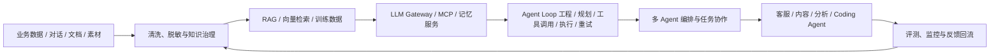

# Hi, I'm zhushen12580 👋

**AI Architect · AI Application Engineer · Agent Builder**

专注于把大模型能力变成可落地、可观测、可持续演进的生产级系统。主要研究和实践方向包括多智能体架构、Agent 编排、RAG、上下文工程、模型微调、多模态应用与 AI 基础设施。

我关注的不只是“模型能不能回答”，更是整个系统能否解决真实问题：如何理解业务、组织数据、调用工具、控制成本、处理故障，并持续从反馈中优化。

---

## 我在做什么

- 构建具备任务规划、工具调用、状态管理和故障恢复能力的 **AI Agent 系统**。
- 设计覆盖数据、模型、工具和应用的 **多智能体共享基础设施**。
- 打造结合向量检索、重排序、知识治理与多模态召回的 **生产级 RAG 系统**。
- 探索 **Coding Agent、代码知识图谱、上下文工程与开发者工具**。
- 推动 AI 应用从原型走向生产，重点解决可观测性、稳定性、并发治理和成本优化。

## 技术方向

| 方向 | 技术与实践 |
| --- | --- |
| Agent 与编排 | LangGraph、Multi-Agent、Agent Loop、MCP、Tool Calling、SubGraph、Checkpoint |
| 大模型工程 | Prompt Engineering、Context Engineering、Structured Output、LLM Gateway、模型路由 |
| RAG 与知识库 | Embedding、混合检索、Cross-Encoder Rerank、HNSW、pgvector、Milvus |
| 模型与多模态 | QLoRA、SFT、DPO、OCR、ASR、TTS、VLM、图文视频检索 |
| 后端与数据 | Python、FastAPI、PostgreSQL、Redis、Celery、SQLAlchemy、ETL |
| 前端与开发者工具 | TypeScript、React、Vue、React Flow、Chrome Extension、WebAssembly |
| 工程与可观测性 | Docker、CI/CD、Langfuse、LangSmith、Prometheus、Grafana、结构化日志 |

## 我理解的 AI 应用架构

我倾向于让基础能力平台化，让业务 Agent 保持轻量：状态下沉、工具标准化、数据可追踪、执行可恢复、成本可度量。

## 精选项目

### Understand Anything · 代码知识图谱与多智能体分析

将静态代码分析与多智能体协作结合，把大型代码库转换为可交互的架构图谱与开发者知识库。

- 设计由 **7 个专业 Agent** 组成的分阶段分析流水线，覆盖项目扫描、架构分析、文档生成和图谱审查。
- 基于 `tree-sitter` 提取函数、类与依赖关系，支持十万行级代码库分析。
- 通过中间产物落盘和按需注入降低上下文占用，支持增量更新与并行处理。
- 使用 React Flow 构建交互式图谱，支持 **3000+ 节点** 的探索与检索。
- 完成多语言输出与跨平台插件适配，覆盖 **13+ AI 编码平台**。

**关键词：** `Multi-Agent` `tree-sitter` `Knowledge Graph` `Context Engineering` `React Flow`

### Coding Agent · 面向网页视觉与样式生成

围绕网页界面理解、样式生成和视觉质量评估构建垂直领域 Coding Agent。

- 自研 Agent Loop，提供 **14 个原子化工具**，按需获取页面结构并执行样式修改。
- 实现多模型统一协议适配、流式工具调用、上下文压缩和长任务执行。
- 引入独立视觉质检 Agent，形成“生成 → 质检 → 修复”的闭环。
- 构建双层技能系统，让设计风格能够沉淀、迁移和跨页面复用。
- 一套接入层适配 **10+ 模型提供方**，样式生成效果提升 **80%**。

**关键词：** `Coding Agent` `Tool Calling` `Visual Audit` `Chrome Extension` `Skills`

### 多智能体业务平台 · 可恢复的 AI 工作流

面向复杂业务流程设计模块化智能体平台，将数据工具、领域规则与 LLM 推理组合为可复用的应用能力。

- 基于 LangGraph 和 PostgreSQL Checkpoint 实现节点级状态持久化、断点恢复与任务续跑。
- 构建统一 LLM 网关，支持多 Key 调度、限流冷却、故障切换与动态路由。
- 使用 MCP 标准化异构数据工具，让新能力能够按模块接入。
- 建设多租户隔离、权限控制、异步任务和完整执行轨迹。
- 接入 Metrics、Logs、Traces 三类观测能力，让智能体执行过程可追踪、可诊断。

**关键词：** `LangGraph` `MCP` `FastAPI` `PostgreSQL` `Redis` `Observability`

### 智能导购与知识问答 · 生产级 RAG 实践

围绕复杂商品知识、实时咨询和多模态问答构建智能交互系统。

- 设计“向量粗召回 → Cross-Encoder 精排 → 结构化应答”检索链路。
- 将知识命中率从 **72% 提升至 89%**，检索速度提升 **4 倍**。
- 通过 Prefix Caching、Prompt 重组与推理链路优化，将首字延迟从 **15 秒压缩至 2 秒以内**。
- 采用“微调管风格、RAG 管知识”的职责分离设计，降低知识更新成本。
- 将模型风格一致性评分从 **2.1 提升至 4.3 / 5**。
- 构建覆盖文字、图片和视频的统一素材召回能力。

**关键词：** `RAG` `Rerank` `QLoRA` `DPO` `Multimodal` `TTFT Optimization`

### AI 数据资产中台 · 从原始数据到可用知识

将原始对话和业务资料加工为可检索、可训练、可评测的数据资产，为下游 AI 应用提供统一数据来源。

- 建设完整的数据链路：采集、去重、清洗、脱敏、审核与多格式导出。
- 实现结构化知识提取、向量知识库构建以及训练数据生成。
- 通过分层过滤与多次脱敏保护敏感信息。
- 让知识问答、模型微调、自动评测和素材生成共享同一份可信数据。
- 建立应用反馈回流机制，持续改善数据质量与模型表现。

**关键词：** `ETL` `Data Governance` `Privacy` `Vector Database` `LLM Evaluation`

### Agent 共享基础设施 · 让业务能力快速复用

把多个 AI 应用中的共性能力抽离为独立共享服务，减少重复建设并统一治理。

- 将 LLM 网关、RAG 检索、会话记忆与 Prompt 管理拆分为独立 MCP 服务。
- 构建标准化工具协议、身份认证、配额管理和租户隔离。
- 设计跨应用共享的用户画像与会话记忆体系。
- 支撑 **运营素材 Agent** 与 **直播高光提炼 Agent** 等业务应用。
- 通过模型分级路由与成本追踪，将推理成本降低 **40%**。
- 在长视频处理场景中，将上传数据体积降低 **99%**。

**关键词：** `MCP Server` `Agent Infrastructure` `Memory` `Model Routing` `Cost Governance`

## 一些实践结果

| 指标 | 结果 |
| --- | --- |
| RAG 知识命中率 | 72% → 89% |
| 实时对话首字延迟 | 15 秒 → 2 秒以内 |
| 模型风格一致性 | 2.1 → 4.3 / 5 |
| 推理成本 | 降低 40% |
| 视频上传体积 | 降低 99% |
| 代码图谱规模 | 3000+ 节点 |
| 编码插件适配 | 13+ 平台 |
| 模型统一接入 | 10+ 提供方 |

## 我相信的工程原则

- **Agent 不是对话框，而是能够完成任务的系统。**
- **RAG 管知识，微调管风格，工具管行动。**
- **上下文不是越长越好，而是越相关越好。**
- **智能体可以有状态，但状态不应该只存在于对话里。**
- **一个真正可上线的 AI 系统，必须同时考虑效果、成本、稳定性与可观测性。**

---

欢迎通过 [GitHub](https://github.com/zhushen12580) 交流 Agent、RAG、AI 基础设施和开发者工具。
